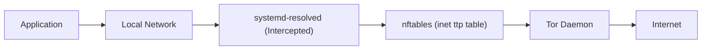

<!--
Copyright (c) 2026 onyks-os
SPDX-License-Identifier: MIT
-->

<h1 align="center">
  TTP - Transparent Tor Proxy
</h1>

<h4 align="center">A Linux CLI tool that transparently routes <b>all system traffic</b> through the Tor network using nftables.</h4>

<p align="center">
  <a href="https://github.com/sponsors/onyks-os"></a>
  
  
  <a href="https://github.com/onyks-os/TransparentTorProxy/actions/workflows/ci.yml"></a>
  <a href="https://pypi.org/project/transparent-tor-proxy/"></a>
  <a href="https://www.bestpractices.dev/projects/13164"></a>
  
</p>

<p align="center">
  <a href="#features">Features</a> •
  <a href="#requirements">Requirements</a> •
  <a href="#installation">Installation</a> •
  <a href="#usage">Usage</a> •
  <a href="#how-it-works">How It Works</a> •
  <a href="#obtain-feedback--contributions">Contribute</a>
</p>

---

<p align="center">
  
</p>

---

No per-application setup needed - just `sudo ttp start` and **every connection** goes through Tor.

> [!CAUTION]
> TTP is a tool designed to aid privacy by routing traffic through Tor. However, no tool can guarantee 100% anonymity. Your safety also depends on your behavior (e.g., using a regular browser vs. Tor Browser, signing into accounts, etc.). Always use TTP as part of a multi-layered security strategy.

> [!WARNING]
> **If you are a whistleblower or are engaging in high-risk activities, DO NOT use TTP.** Instead, use officially audited and reliable tools like [TailsOS](https://tails.net/) or the [Tor Browser](https://www.torproject.org/) directly. The authors and contributors of TTP assume no responsibility for your safety or the consequences of using this software.

## Why TTP?

Unlike legacy transparent proxy scripts (e.g., TorGhost, Anonsurf) that rely on destructive configuration file overrides and outdated iptables rulesets, TTP is engineered as a systemd-native, fail-closed solution for modern Linux distributions.

Key architectural advantages:
* **No Per-Application Configuration**: Intercepts all TCP and DNS traffic globally at the network layer, eliminating the need to configure SOCKS5 settings in individual applications.
* **Zero DNS Leaks**: Reroutes DNS queries via a kernel-level bind-mount overlay on `/etc/resolv.conf` (with automated cleanup on teardown), resolving leaks natively without altering persistent files.
* **Systemd-Native Fail-Closed Design**: Leverages isolated `inet ttp` nftables tables and dedicated systemd units. In the event of a crash, watchdog trigger, or unclean termination, the network is either securely routed via Tor or blocked entirely (fail-closed), preventing cleartext leaks.
* **Volatile Core**: The entire session state, temporary configurations, lockfiles, and logs reside exclusively in volatile memory (`tmpfs`), leaving no forensic footprint on physical storage.

## Features

* **Volatile Core**: Stores the entire session state, lockfiles, and logs exclusively in volatile `tmpfs` (`/run/ttp/` and `/run/tor/ttp/`), ensuring no traces are written to physical storage and all state disappears automatically on reboot.
* **Stateless Overlay & systemd-resolved Intercept**: Transparently routes DNS requests using a kernel-level `mount --bind` overlay on `/etc/resolv.conf` without modifying the original file on disk. Hijacks active `systemd-resolved` configurations using a volatile drop-in to prevent leaks via D-Bus or NSS, backed by a strict kernel-level firewall drop policy on non-localhost outbound resolved queries.
* **Continuous Integrity Protection (Watchdog & Killswitch)**: Runs an active background monitor checking Tor status, nftables chain presence, and the DNS overlay mount, automatically triggering single-strike repairs or a hard network lockout (emergency drop-all killswitch) on persistent integrity failure.
* **Preserved LAN Access & Segmented Traffic (LAN Bypass & Split Tunneling)**: Dynamically excludes local subnets (RFC 1918 and Link-Local) from Tor routing to preserve access to local devices. Supports user- or group-specific exemptions (`--bypass-user` / `--bypass-group`) using native `nftables` UID/GID checks.
* **Zero IPv6 Leaks (Dual-Stack Redirection)**: Dynamically detects IPv6 routing availability, building dual-stack redirect chains or applying drop rules to outgoing IPv6 traffic when loopback routing is not available.
* **Block Secure DNS Bypasses (DoT/DoH Mitigation)**: Rejects outbound DoT (port 853) and well-known public DoH resolver IPs (port 443) to force fallback to Tor DNS, mapping canary domains in `torrc` to disable browser-level DoH.
* **Coexistence with System Tor (Native Tor Service Management)**: Manages Tor via a dedicated, volatile `ttp-tor.service` systemd unit running on non-standard ports, coexisting with standard system Tor instances.

## Requirements

* **Linux with systemd**
* **Python 3.10+**
* **nftables** (pre-installed on most modern distros)
* **Root privileges** (required for firewall and DNS modifications)

## Installation

Choose the method that best fits your needs. **Native packages are strongly recommended** for system stability, security, and clean uninstallation.

### 1. Native Packages (Recommended)

Installing via native packages ensures that all system dependencies (`tor`, `nftables`) and kernel-level optimizations (SELinux) are managed by your OS package manager.

* **Debian / Ubuntu**: `sudo apt install ./packaging/transparent-tor-proxy_0.4.6_all.deb`
* **Fedora / RHEL**: `sudo dnf install ./packaging/transparent-tor-proxy-0.4.6-1.fc43.noarch.rpm`
* **Arch Linux**: `cd packaging && makepkg -si`

For instructions on how to verify the integrity and authenticity of the release assets, see the [Release Verification Guide](docs/verification.md).

---

### 2. Manual Source Install (Developer/Universal)

If you are a developer or want to install from the repository:

```bash
git clone https://github.com/onyks-os/TransparentTorProxy.git
cd TransparentTorProxy
sudo ./scripts/install.sh
```

> [!TIP]
> **Why use `./install.sh`?**  
> Unlike standard Python installers, this script is **"intelligent"**. On Red Hat-based systems, it detects if SELinux is in *Enforcing* mode and dynamically compiles a custom policy module (from `ttp_tor_policy.te`) to allow Tor to bind to the non-standard ports required by TTP (9041, 9054). This kernel-level optimization cannot be performed by `pip`.

### 3. Alternative Installation Methods (Fallback)

For installing TTP via Python-specific package managers (`pipx` or `pip` with virtual environments), see the [Alternative Installation Methods Reference](docs/install-alternatives.md).

## Usage

TTP is designed to be simple and lightweight. For the complete list of CLI commands, options, exit codes, and technical specifications, refer to the [External Interfaces Reference](docs/interfaces.md).

### Quick Start

Most network-modifying commands require root privileges (`sudo`):

* **Start the proxy**:
  ```bash
  sudo ttp start
  ```
* **Stop the proxy**:
  ```bash
  sudo ttp stop
  ```
* **Check current session status**:
  ```bash
  ttp status
  ```
* **Verify Tor routing and latency**:
  ```bash
  ttp check
  ```
* **Request a new exit IP (rotate circuits)**:
  ```bash
  sudo ttp refresh
  ```

For more advanced setups and circumvention profiles, see the [Advanced Security & Usage Profiles Reference](docs/profiles.md) or consult the [External Interfaces Reference](docs/interfaces.md).

## Manual Leak Verification

<details>
<summary>Click to expand manual verification steps</summary>

To confirm that the tunnel is working correctly and no leaks are present:

1. **Verify Tor Exit IP:**

   ```bash
   curl -s https://check.torproject.org/api/ip
   ```

2. **Verify DNS Routing:**

   ```bash
   # Should return a valid IP via Tor's DNSPort
   dig +short A check.torproject.org
   ```

3. **DNS Leak Test (Terminal):**

   ```bash
   # This TXT query SHOULD return an EMPTY output
   dig +short TXT whoami.ipv4.akahelp.net
   ```

   *Note: An empty output is the **expected** behavior under Tor. Tor's transparent resolver does not support TXT records; if this command returns your real ISP's IP, you have a DNS leak.*

4. **Web-based Verification:**
   Always perform additional tests on [dnsleaktest.com](https://www.dnsleaktest.com) and [ipleak.net](https://ipleak.net).

</details>

### Full Uninstallation

To remove TTP completely from the system:

```bash
sudo ./scripts/uninstall.sh
```

## How It Works

TTP transparently routes all network traffic by orchestrating standard Linux kernel subsystems, system utilities, and Tor's control interfaces:



1. **Atomic Firewall Redirection**: Generates and loads an isolated `inet ttp` nftables ruleset atomically to intercept TCP and DNS traffic, redirecting them to Tor while preventing IPv6 and DoT/DoH leaks.
2. **DNS Bind-Mount Overlay**: Overlays `/etc/resolv.conf` with a volatile RAM-backed configuration via a kernel-level bind-mount to ensure DNS calls are resolved by Tor.
3. **Tor Daemon Integration**: Configures, runs, and monitors an isolated Tor instance via volatile systemd services on non-standard ports to prevent port conflicts.
4. **Session Watchdog**: Runs an active background monitor that verifies configuration integrity and executes a fail-closed emergency killswitch upon security breach or system modification.

For a detailed walkthrough of the execution flows, system hooks, security boundaries, and modular components, please refer to the:

**[Technical Architecture & Design Guide](docs/architecture.md)**

## Crash Recovery

TTP is designed to always restore your network, even in edge cases:

| Scenario                 | What happens                                                                                                                                                                                                                              |
| :----------------------- | :---------------------------------------------------------------------------------------------------------------------------------------------------------------------------------------------------------------------------------------- |
| `ttp stop`               | **Zero-leak cleanup**: applies teardown lockdown, gracefully shuts down Tor, executes active socket slaughter, waits 1.5s, flushes connection tracking, restores firewall and DNS (via table flush and delete), and deletes the lock file |
| Ctrl+C / `kill`          | Signal handler catches `SIGINT`/`SIGTERM` and runs normal cleanup before exit                                                                                                                                                             |
| `kill -9` / Power Outage | Next `ttp start` detects the orphaned lock file, clears any stale mount stacks, and auto-restores                                                                                                                                         |
| Manual emergency         | Run `sudo ./scripts/restore-network.sh` to flush all nftables rules, reset DNS, and delete the lock file                                                                                                                                  |

## Known Behavior & Limitations

> [!WARNING]
>
> * **Tor Browser**: Applications using an explicit SOCKS5 proxy will create a double Tor hop. Use a regular browser instead while TTP is active.
> * **DNS-over-HTTPS (DoH)**: Normal browsers (Firefox, Chrome, Brave, Edge) may use DoH, bypassing system DNS. TTP mitigates this by blocking well-known DoH resolver IPs (forcing fallback to Tor DNS) and routing unlisted DoH traffic through Tor (which can, however, partially compromise anonymity). For maximum security, disable **DoH / "Secure DNS"** in your browser settings.
> * **IPv6**: Fully supported when available. TTP dynamically detects IPv6 loopback and routes IPv6 traffic through Tor. If the host lacks IPv6 loopback support OR if the `--no-ipv6` option is passed, TTP drops all outgoing IPv6 traffic to prevent leaks.
> * **Exit IP variation**: Different connections may show different exit IPs due to Tor stream isolation.

For a full breakdown of residual risks, architectural trust boundaries, and the STRIDE threat model, see:

**[`docs/security-assessment.md`](docs/security-assessment.md)**

## Development & Testing

TTP uses a **Makefile** to automate and standardize the testing pipeline. This ensures that every change is verified against unit and integration tests before being committed.

### The "Pre-Push" Rule
>
> [!IMPORTANT]
> **Always run `make verify` before pushing code.** If this command fails, the code is NOT ready for production.

### Essential Commands

| Command                   | Goal                                                                      |
| :------------------------ | :------------------------------------------------------------------------ |
| `make test`               | Runs fast **Unit Tests** locally (no root needed, fully mocked).          |
| `make integration-debian` | Runs full system tests inside a privileged **Docker** container (Debian). |
| `make integration-all`    | Runs integration tests for all supported distros (Debian, Fedora, Arch).  |
| `make verify`             | Runs Unit Tests + All Integration Tests.                                  |
| `make build`              | Generates native `.deb` and `.rpm` packages.                              |
| `make clean`              | Removes all build artifacts, caches, and temp files.                      |

### Ruleset Verification via Network Sandbox Engine (NSE)
TTP integrates the **Network Sandbox Engine (NSE)**, a development dependency, to run programmatic validation of TTP's `nftables` rulesets inside isolated network namespaces:
* **Zero-Leak PCAP Assertion**: Tests apply the actual firewall rules and inject test packets (TCP connections, DNS lookups, bypassed identities). A Scapy sniffer runs on the boundary virtual interface (`veth`) and asserts that no cleartext packets escape to the WAN.
* **To run ruleset tests**: Install NSE (`pip install network-sandbox-engine>=1.1.0 pyroute2`) and run:
  ```bash
  sudo pytest tests/test_nse_rules.py -v
  ```

### Advanced: Real-World VM Testing

While Docker integration tests are fast and atomic, they don't capture 100% of the kernel/systemd nuances. For critical changes, it is **highly recommended** to test in a real QEMU VM:

```bash
# Start a specific VM (e.g., arch)
./scripts/vm/start.sh arch

# Sync current code to the VM
./scripts/vm/send.sh

# Snapshot management for easy rollbacks
./scripts/vm/snapshot.sh arch save before-risky-test
```

### Diagnostics

If something goes wrong, run the diagnostic command:

```bash
sudo ttp diagnose
```

## Project Structure

```text
├── pyproject.toml          # Package metadata and dependencies
├── README.md
├── CONTRIBUTING.md         # Contribution guidelines
├── SECURITY.md             # Security policy
├── scripts/                # Installation, verification, and VM management scripts
├── assets/                 # Branding and demo assets
├── packaging/              # Packaging configurations (.deb, .rpm, Arch PKGBUILD)
├── ttp/                    # Main Python source package
│   └── resources/          # Internal package resources (SELinux policies, etc.)
├── tests/                  # Unit, integration, and leak testing suites
└── docs/                   # Technical documentation, threat models, and ADRs
```

## Call for Contributors

We are actively looking for developers to join the TTP project! Whether you are a student looking to learn or a seasoned professional, your help is welcome.

**We are particularly seeking Senior Developers** with expertise in:

* **Linux Networking** (nftables, routing tables, network namespaces).
* **Tor Internals** (daemon configuration, Stem library, circuit management).
* **System-level Python** (asynchronous I/O, process management, security best practices).

If you want to contribute to making transparent proxying safer and more robust, please check out our [Contributing Guidelines](CONTRIBUTING.md) or dive right into the [Issues](https://github.com/onyks-os/TransparentTorProxy/issues).

## Obtain, Feedback & Contributions

- **Obtain**: TTP is available on [PyPI](https://pypi.org/project/transparent-tor-proxy/) and can also be downloaded from the [GitHub Releases](https://github.com/onyks-os/TransparentTorProxy/releases) page. For installation methods, see the [Installation](#installation) section.
- **Feedback**: Report bugs, suggest enhancements, or request features by opening a ticket on the [GitHub Issues](https://github.com/onyks-os/TransparentTorProxy/issues) tracker.
- **Contribute**: Contributions are always welcome! Review our [Contributing Guidelines](CONTRIBUTING.md) to learn how to submit code, follow coding standards, and run tests.
- **Security**: Please review our [Security Policy](SECURITY.md) before reporting any vulnerabilities or security concerns.

## Support

For version support status, EOL information, and support channels, please refer to the [Support Policy](SUPPORT.md).

This project is maintained in my free time, and donations are highly appreciated.

<div align="center">

Also, if you find **TTP** useful, please consider giving it a **Star**!  
It helps others discover the tool and motivates further development.

[](https://github.com/onyks-os/TransparentTorProxy)

</div>

## License

MIT. See [LICENSE](LICENSE) for more information.
