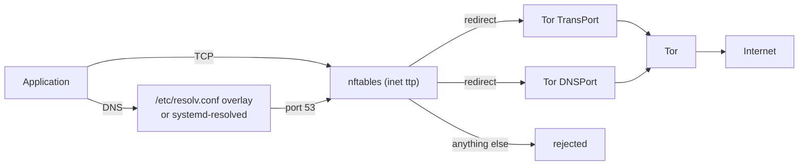

<!--
Copyright (c) 2026 onyks-os
SPDX-License-Identifier: MIT
-->

<p align="center">
  
</p>

<!-- <h1 align="center">
  TTP - Transparent Tor Proxy
</h1> -->

<h4 align="center">A Linux CLI tool that transparently routes <b>all system traffic</b> through the Tor network using nftables.</h4>

<p align="center">
  <a href="https://github.com/sponsors/onyks-os"></a>
  
  
  <a href="https://github.com/onyks-os/TransparentTorProxy/actions/workflows/ci.yml"></a>
  <a href="https://onyks-os.github.io/ttp/"></a>
  <a href="https://pypi.org/project/transparent-tor-proxy/"></a>
  <a href="https://www.bestpractices.dev/projects/13164"></a>
  
</p>

<p align="center">
  <a href="#features">Features</a> •
  <a href="#requirements">Requirements</a> •
  <a href="#installation">Installation</a> •
  <a href="#usage">Usage</a> •
  <a href="#how-it-works">How It Works</a> •
  <a href="#verification">Verification</a> •
  <a href="#contributing">Contribute</a>
</p>

---

<p align="center">
  
</p>

---

No per-application setup needed - just `sudo ttp start` and **every connection** goes through Tor.

> [!CAUTION]
> TTP is a tool designed to aid privacy by routing traffic through Tor. However, no tool can guarantee 100% anonymity. Your safety also depends on your behavior (e.g., using a regular browser vs. Tor Browser, signing into accounts, etc.). Always use TTP as part of a multi-layered security strategy.

<!-- -->

> [!WARNING]
> **If you are a whistleblower or are engaging in high-risk activities, DO NOT use TTP.** Instead, use officially audited and reliable tools like [TailsOS](https://tails.net/) or the [Tor Browser](https://www.torproject.org/) directly. The authors and contributors of TTP assume no responsibility for your safety or the consequences of using this software.

## Why TTP?

Legacy transparent proxy scripts (TorGhost, Anonsurf) overwrite configuration
files and build iptables rulesets that fail *open*: when they break, traffic
leaves in cleartext. TTP is built the other way round - it fails closed, and
keeps nothing on disk.

| | |
| :--- | :--- |
| **Fail-closed by construction** | An isolated `inet ttp` nftables table with a catch-all reject and `policy drop` on forwarding. On a crash, a watchdog trigger or an unclean exit, traffic is either routed through Tor or blocked - never released. |
| **Nothing persists** | Session state, torrc, lock file and logs live only in `tmpfs` (`/run/ttp/`, `/run/tor/ttp/`). A reboot leaves no residue and no stale lock - and no session either: see [Known Behavior & Limitations](#known-behavior--limitations). |
| **No per-application setup** | TCP and DNS are intercepted at the network layer. No SOCKS5 settings, no proxy environment variables, no application support required. |
| **DNS without rewriting your system** | A `mount --bind` overlay on `/etc/resolv.conf` rather than an edit, plus a volatile drop-in that neutralises `systemd-resolved`, backed by a kernel-level drop on any non-loopback resolver traffic. |
| **The leak claim is measured** | Every containment rule is tested in an isolated network namespace against the real generated ruleset, and each test first proves it can *see* a leak before asserting there is none. See [Verification](#verification). |

## Features

* **Continuous integrity protection** (`--watchdog`) - a watchdog governed by a
  formal FSM (`transitions`) compares the live `inet ttp` table, rule for rule,
  with the one the session applied, and watches Tor and the DNS overlay. It is
  woken by nftables and inotify events rather than polling, so a flushed or
  altered table reaches the killswitch in tens of milliseconds (31-48 ms
  measured). A failed Tor is restarted once; a changed table or DNS overlay is
  treated as tampering. Either way, if the session is not intact the watchdog
  applies an emergency killswitch and holds it until `ttp stop`, re-applying it
  if something removes or alters it.
* **Split tunnelling** - exempt users or groups (`--bypass-user`,
  `--bypass-group`) with native nftables UID/GID matching, or run a single
  command outside Tor with `ttp bypass <cmd>` via a cgroups v2 slice.
* **LAN preserved** - RFC 1918 and link-local subnets stay reachable, so your
  printer and NAS keep working.
* **Dual-stack, or no stack** - IPv6 is routed through Tor when loopback
  routing is available, and dropped outright when it is not. There is no third
  option where it leaks.
* **DoH and DoT contained by construction** - all TCP goes to Tor, DNS on port
  53 goes to Tor's DNSPort, everything else is rejected. A browser's DoH or DoT
  query therefore leaves through a Tor exit like any other connection, whoever
  the resolver is; no blocklist is involved
  ([ADR 0012](docs/decisions/0012-doh-dot-and-browser-leaks-are-out-of-scope.md)).
* **Coexists with your system Tor** - runs its own volatile `ttp-tor.service`
  on non-standard ports, leaving an existing Tor instance untouched.
* **Bridges** - obfs4 and snowflake, with BYOD (bring your own daemon) mode.

## Requirements

* **Linux with systemd**
* **Python 3.10+**
* **nftables** (pre-installed on most modern distros)
* **Root privileges** (required for firewall and DNS modifications)

## Installation

Choose the method that best fits your needs. **Native packages are strongly recommended** for system stability, security, and clean uninstallation.

### 1. Native Packages (Recommended)

Installing via native packages ensures that all system dependencies (`tor`, `nftables`) and kernel-level optimizations (SELinux) are managed by your OS package manager.

Download the `.deb` or `.rpm` for the version you want from the [latest release](https://github.com/onyks-os/TransparentTorProxy/releases/latest) - the packages are release assets and are not checked into the repository - then install it:

* **Debian / Ubuntu**: `sudo apt install ./transparent-tor-proxy_0.4.10_all.deb`
* **Fedora 44**: `sudo dnf install ./transparent-tor-proxy-0.4.10-1.fc44.noarch.rpm`
* **Arch Linux**: build from the repository with `cd packaging && makepkg -si`

For instructions on how to verify the integrity and authenticity of the release assets, see the [Release Verification Guide](docs/verification.md).

---

### 2. Manual Source Install (Developer/Universal)

If you are a developer or want to install from the repository:

```bash
git clone https://github.com/onyks-os/TransparentTorProxy.git
cd TransparentTorProxy
sudo ./scripts/install.sh
```

> [!TIP]
> **Why use `./install.sh`?**  
> Unlike standard Python installers, this script is **"intelligent"**. On Red Hat-based systems, it detects if SELinux is in *Enforcing* mode and dynamically compiles a custom policy module (from `ttp_tor_policy.te`) to allow Tor to bind to the non-standard ports required by TTP (9041, 9054). This kernel-level optimization cannot be performed by `pip`.

### 3. Alternative Installation Methods (Fallback)

For installing TTP via Python-specific package managers (`pipx` or `pip` with virtual environments), see the [Alternative Installation Methods Reference](docs/install-alternatives.md).

## Usage

TTP is designed to be simple and lightweight. For the complete list of CLI commands, options, exit codes, and technical specifications, refer to the [External Interfaces Reference](docs/interfaces.md).

### Quick Start

Most network-modifying commands require root privileges (`sudo`):

* **Start the proxy**:

  ```bash
  sudo ttp start
  ```

* **Stop the proxy**:

  ```bash
  sudo ttp stop
  ```

* **Check current session status**:

  ```bash
  ttp status
  ```

* **Verify Tor routing and latency**:

  ```bash
  ttp check
  ```

* **Request a new exit IP (rotate circuits)**:

  ```bash
  sudo ttp refresh
  ```

For more advanced setups and circumvention profiles, see the [Advanced Security & Usage Profiles Reference](docs/profiles.md) or consult the [External Interfaces Reference](docs/interfaces.md).

## Checking Your Session

<details>
<summary>Click to expand manual verification steps</summary>

To confirm that the tunnel is working correctly and no leaks are present:

1. **Verify Tor Exit IP:**

   ```bash
   curl -s https://check.torproject.org/api/ip
   ```

2. **Verify DNS Routing:**

   ```bash
   # Should return a valid IP via Tor's DNSPort
   dig +short A check.torproject.org
   ```

3. **DNS Leak Test (Terminal):**

   ```bash
   # This TXT query SHOULD return an EMPTY output
   dig +short TXT whoami.ipv4.akahelp.net
   ```

   *Note: An empty output is the **expected** behavior under Tor. Tor's transparent resolver does not support TXT records; if this command returns your real ISP's IP, you have a DNS leak.*

4. **Web-based Verification:**
   Always perform additional tests on [dnsleaktest.com](https://www.dnsleaktest.com) and [ipleak.net](https://ipleak.net).

</details>

### Full Uninstallation

To remove TTP completely from the system:

```bash
sudo ./scripts/uninstall.sh
```

## How It Works

TTP transparently routes all network traffic by orchestrating standard Linux kernel subsystems, system utilities, and Tor's control interfaces:


```mermaid
flowchart LR
    App["Application"] -->|TCP| NFT["nftables (inet ttp)"]
    App -->|DNS| Resolver["/etc/resolv.conf overlay<br/>or systemd-resolved"]
    Resolver -->|port 53| NFT
    NFT -->|redirect| TransPort["Tor TransPort"]
    NFT -->|redirect| DNSPort["Tor DNSPort"]
    NFT -->|anything else| Reject["rejected"]
    TransPort --> Tor["Tor"]
    DNSPort --> Tor
    Tor --> Internet["Internet"]
```

1. **Atomic Firewall Redirection**: Generates and loads an isolated `inet ttp` nftables ruleset atomically: TCP is redirected to Tor's TransPort, DNS on port 53 to Tor's DNSPort, and every other packet is rejected.
2. **DNS Bind-Mount Overlay**: Overlays `/etc/resolv.conf` with a volatile RAM-backed configuration via a kernel-level bind-mount to ensure DNS calls are resolved by Tor.
3. **Tor Daemon Integration**: Configures, runs, and monitors an isolated Tor instance via volatile systemd services on non-standard ports to prevent port conflicts.
4. **Session Watchdog** (`--watchdog`): An optional background daemon that verifies the session's integrity on every nftables or inotify event and every 15 seconds. It restarts a failed Tor once; anything else that is not intact - the table, the DNS overlay - engages a fail-closed emergency killswitch, which it holds until `ttp stop`.

For a detailed walkthrough of the execution flows, system hooks, security boundaries, and modular components, please refer to the:

**[Technical Architecture & Design Guide](docs/architecture.md)**

## Crash Recovery

TTP is designed to always restore your network, even in edge cases:

| Scenario                 | What happens                                                                                                                                                                                                                              |
| :----------------------- | :---------------------------------------------------------------------------------------------------------------------------------------------------------------------------------------------------------------------------------------- |
| `ttp stop`               | **Zero-leak cleanup**: stops the watchdog, applies the teardown lockdown, shuts Tor down gracefully, kills open sockets, flushes connection tracking, removes the `inet ttp` table, restores DNS, and deletes the lock file - the lock last, even if a step before it fails |
| Ctrl+C / `kill`          | Signal handler catches `SIGINT`/`SIGTERM` and runs normal cleanup before exit                                                                                                                                                             |
| `kill -9` / Power Outage | Next `ttp start` detects the orphaned lock file, clears any stale mount stacks, and auto-restores                                                                                                                                         |
| Manual emergency         | Run `sudo ./scripts/restore-network.sh` to flush all nftables rules, reset DNS, and delete the lock file                                                                                                                                  |

## Known Behavior & Limitations

> [!WARNING]
>
> * **Tor Browser**: Applications using an explicit SOCKS5 proxy will create a double Tor hop. Use a regular browser instead while TTP is active.
> * **DNS-over-HTTPS (DoH)**: Browsers (Firefox, Chrome, Brave, Edge) may use DoH instead of the system resolver. For a process that is not bypassed this is not a leak: DoH is TCP, and all TCP goes through Tor. It does mean a DoH provider sees your queries (from a Tor exit), and some settings make name resolution fail rather than leak. Turning off **DoH / "Secure DNS"** in the browser keeps DNS on Tor's own resolver. What happens to each application-level resolver, and how to check yours: [Applications that resolve DNS on their own](docs/web/how-to/apps-with-own-dns.md).
> * **IPv6**: Fully supported when available. TTP dynamically detects IPv6 loopback and routes IPv6 traffic through Tor. If the host lacks IPv6 loopback support OR if the `--no-ipv6` option is passed, TTP drops all outgoing IPv6 traffic to prevent leaks.
> * **Exit IP variation**: Different connections may show different exit IPs due to Tor stream isolation.
> * **No protection across a reboot**: a session does not survive a reboot, and TTP has no start-at-boot mode. After a reboot TTP is not running and **all traffic is in cleartext**, from early in boot, until you run `ttp start` again. `ttp status` says so (`No active session. Traffic is in cleartext.`), but nothing warns you on its own. This is measured, not assumed: see [section 4.3 of the security assessment](docs/security-assessment.md#43-lifecycle-transitions-what-is-measured-and-what-is-not).

For a full breakdown of residual risks, architectural trust boundaries, and the STRIDE threat model, see:

**[`docs/security-assessment.md`](docs/security-assessment.md)**

## Development & Testing

TTP uses a **Makefile** to automate and standardize the testing pipeline. This ensures that every change is verified against unit and integration tests before being committed.

### The "Pre-Push" Rule
>
> [!IMPORTANT]
> **Always run `make verify` before pushing code.** If this command fails, the code is NOT ready for production.

### Essential Commands

| Command                   | Goal                                                                                 |
| :------------------------ | :----------------------------------------------------------------------------------- |
| `make verify`             | The gate to run before every push: lint (ruff, mypy, ShellCheck, markdownlint, secret scan), unit tests, dependency audit. |
| `make test`               | Unit tests only (no root needed, fully mocked).                                      |
| `make coverage`           | Unit tests with a coverage report; fails below the ratchet.                          |
| `make test-nse`           | The zero-leak ruleset suite in a network namespace (root, `.[nse]` extra).           |
| `make integration-debian` | Integration tests in a privileged **Docker** container (also `-fedora`, `-arch`, `-all`). |
| `make chaos-monkey`       | The watchdog chaos sweep on a disposable host (root).                                |
| `make verify-full`        | The pre-release suite: lint, unit, integration and packages.                         |
| `make packages`           | Builds the native `.deb` and `.rpm` packages (`make build` builds the Python distributions). |
| `make clean`              | Removes all build artifacts, caches, and temp files.                                 |

## Verification

TTP's zero-leak claim is measured, not asserted. The
[Network Sandbox Engine](https://github.com/onyks-os/NetworkSandboxEngine) builds
an isolated network namespace, loads TTP's *real* generated ruleset into it,
generates the traffic a leak would consist of, and watches the boundary `veth`
interface with a Scapy sniffer.

**Every containment test runs twice.** `assert no leaks` is also true when the
sniffer never started, when the interface name is wrong, or when the traffic
never left the process, so each test first runs the same stimulus with the
ruleset **flushed** and requires the packet to be seen. Only then does it assert
that TTP's ruleset stops it. A harness that cannot observe a leak fails the
test rather than passing it.

Covered: plain DNS (UDP and TCP), ordinary TCP, DoT on 853, QUIC DoH on UDP/443,
ICMP, arbitrary UDP, IPv6 and routable ICMPv6; containment with a Docker-, ufw-,
firewalld- or WireGuard-shaped ruleset loaded alongside TTP's, and with a foreign
NAT chain that DNATs DNS to a LAN resolver; forwarded traffic; the teardown
lockdown; a connection open before `ttp start`, which must be reset rather than
left hanging. And the other direction: a bypassed UID still reaches the LAN and
gets an answer back. A firewall that blocked everything would pass every
containment test and fail those.

```bash
# libpcap is required: the sniffer compiles a BPF filter, and Scapy dlopen()s
# the unversioned libpcap.so that only the -devel/-dev package ships.
sudo apt install nftables iproute2 conntrack libpcap0.8 libpcap-dev   # Debian/Ubuntu
sudo dnf install nftables iproute2 conntrack libpcap libpcap-devel    # Fedora/RHEL
pip install -e ".[nse]"
make test-nse            # runs as root; TTP_REQUIRE_NSE=1 so it cannot skip itself
```

This runs in CI on every push (the **Zero-leak ruleset verification** job) and as
a step in `scripts/verify.sh` before a release.

### Lifecycle and chaos, in a VM

Two things a namespace cannot show run in a disposable VM, in CI
(`.github/workflows/lifecycle.yml`) whenever firewall, lifecycle, DNS or watchdog
code changes, and weekly:

* **Lifecycle transitions** - shutdown, reboot, and suspend/resume onto a new
  network, judged from a packet capture QEMU writes outside the guest, on Debian 13
  (systemd-networkd) and Fedora 44 (NetworkManager, SELinux enforcing).
* **The watchdog chaos sweep** - every fault once against a live session (Tor
  stopped or killed behind systemd's back, the table flushed or destroyed, the DNS
  overlay unmounted, the link flapped), each audit paired with a canary that proves
  it could have seen a leak.

What each asserts, and what it found, is in
[section 4.3 of the security assessment](docs/security-assessment.md#43-lifecycle-transitions-what-is-measured-and-what-is-not).
To run them locally, see [VM & Chaos Testing](docs/web/how-to/vm-testing.md).

### Diagnostics

If something goes wrong, run the diagnostic command:

```bash
sudo ttp diagnose
```

## Project Structure

```text
├── pyproject.toml          # Package metadata and dependencies
├── README.md
├── CONTRIBUTING.md         # Contribution guidelines
├── SECURITY.md             # Security policy
├── scripts/                # Installation, verification, and VM management scripts
├── assets/                 # Branding and demo assets
├── packaging/              # Packaging configurations (.deb, .rpm, Arch PKGBUILD)
├── ttp/                    # Main Python source package
│   └── resources/          # Internal package resources (SELinux policies, etc.)
├── tests/                  # Unit, integration, and leak testing suites
└── docs/                   # Technical documentation, threat models, and ADRs
```

## Contributing

Contributions are welcome, and the areas where help matters most are narrow and
specific:

1. **Linux networking** - nftables, routing tables, network namespaces, VPN
   interface detection.
2. **Tor internals** - daemon configuration, Stem, bridges, bootstrap edge cases.
3. **CI/CD** - keeping the privileged test suites fast and reliable on GitHub
   Actions.

Start with [CONTRIBUTING.md](CONTRIBUTING.md), which documents the two rules this
codebase is built on: never fix a bug without adding the check that would have
caught it, and a test that asserts an absence must first prove it can detect a
presence.

| | |
| :--- | :--- |
| Bugs and feature requests | [GitHub Issues](https://github.com/onyks-os/TransparentTorProxy/issues) |
| Security vulnerabilities | [SECURITY.md](SECURITY.md) - please do not open a public issue |
| Version support and EOL | [SUPPORT.md](SUPPORT.md) |
| Releases and packages | [GitHub Releases](https://github.com/onyks-os/TransparentTorProxy/releases) · [PyPI](https://pypi.org/project/transparent-tor-proxy/) |

This project is maintained in free time. A [star](https://github.com/onyks-os/TransparentTorProxy)
helps others find it; [sponsorship](https://github.com/sponsors/onyks-os) helps
it keep going.

## License

MIT. See [LICENSE](LICENSE) for more information.
