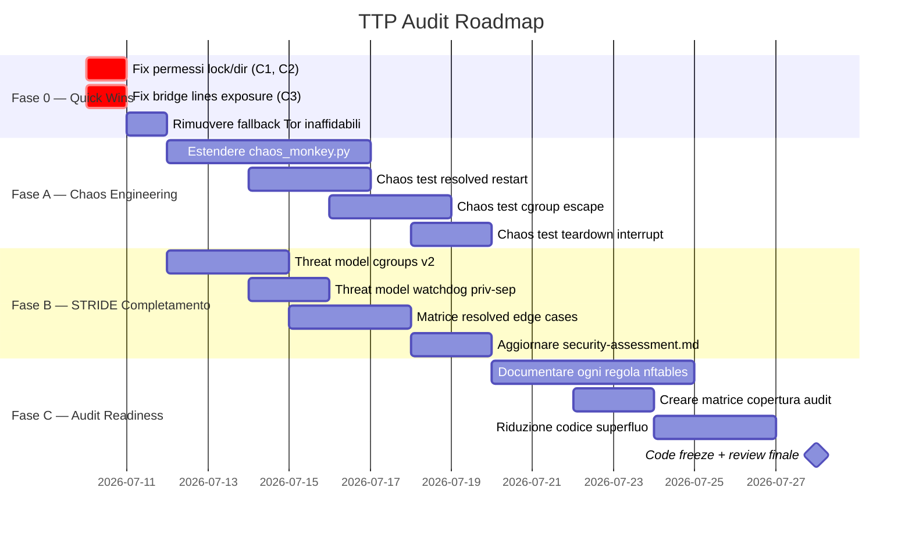

# TTP Audit Plan — Da v0.4.5 a Progetto Inattaccabile

## Parte 1: Dove siamo (v0.4.5 → v0.4.6)

Dalla pubblicazione di v0.4.5 (21 giugno 2026), sono stati effettuati **2 commit significativi** che hanno portato alla **v0.4.6** (25 giugno 2026):

### Commit 1 — v0.4.6 Release (il grosso del lavoro)
| Area                              | Cosa è stato fatto                                                                                                                                                         |
| :-------------------------------- | :------------------------------------------------------------------------------------------------------------------------------------------------------------------------- |
| **cgroups v2 bypass**             | Nuovo comando `ttp bypass <command>` che esegue processi in `ttp-bypass.slice` via `systemd-run`, con regole nftables che esonerano il cgroup dal routing Tor              |
| **Privilege separation watchdog** | Il watchdog ora gira come utente `ttp-watchdog` con solo `CAP_NET_ADMIN`, non più come root. Regola Polkit aggiunta per gestione dei servizi                               |
| **CLI modularizzato**             | Monolite `cli.py` (1595 righe rimosse) → `ttp/commands/` (6 moduli: `start.py`, `stop_restart.py`, `session.py`, `admin.py`, `lifecycle.py`, `watchdog.py` + `_common.py`) |
| **Ottimizzazione teardown**       | Micro-sleep shutdown da 1.5s → 300ms                                                                                                                                       |
| **ADR 0009**                      | Documentazione decisione architetturale per systemd-resolved bypass                                                                                                        |
| **systemd-resolved hardening**    | DNS drop-in volatili più stretti, LLMNR/mDNS disabilitati esplicitamente                                                                                                   |
| **Nuovi test**                    | +87 righe test CLI, +126 righe test DNS, +63 righe test firewall, +123 righe test watchdog                                                                                 |
| **Profili**                       | Nuova documentazione `docs/profiles.md` per scenari d'uso                                                                                                                  |
| **Sysusers**                      | `transparent-tor-proxy.sysusers` per creazione utente ttp-watchdog via systemd                                                                                             |

### Commit 2 — README improvement
Miglioramento documentazione pubblica (50 righe modificate).

### Stato roadmap v0.4.7

| Item v0.4.7                          | Stato                                                                                         |
| :----------------------------------- | :-------------------------------------------------------------------------------------------- |
| CI integration tests su ogni PR      | 🟡 In progress                                                                                 |
| Test suite hygiene                   | 🟡 In progress                                                                                 |
| CLI modularization                   | ✅ **Done** (fase 1 completata in v0.4.6)                                                      |
| Watchdog FSM (state machine formale) | 🔴 Non iniziato                                                                                |
| systemd-resolved hardening           | 🟡 Parziale (ADR 0009 scritto, drop-in migliorato, ma edge cases D-Bus/NSS non ancora coperti) |

---

## Parte 2: Analisi Completa della Codebase — Falle Trovate

Ho letto **ogni singolo file sorgente** del repository. Ecco le falle strutturali categorizzate per severità.

### 🔴 CRITICAL — Da fixare prima di qualsiasi audit

#### C1. Permessi lock file troppo aperti (0644)
- **File:** [state.py](file:///home/onyks/Documents/GitHub/TransparentTorProxy/ttp/state.py#L41-L52)
- **Problema:** `/run/ttp/ttp.lock` è creato con permessi `0644` (world-readable). Contiene: PID, porte, `tor_uid`, utenti/gruppi bypass, e **bridge lines** (dati di censorship circumvention sensibili)
- **Impatto STRIDE:** *Information Disclosure* + *Tampering* (se la dir diventa scrivibile)
- **Fix:** `chmod 0600` + proprietà `root:root`

#### C2. Directory runtime troppo aperta (0755)
- **File:** [state.py:52](file:///home/onyks/Documents/GitHub/TransparentTorProxy/ttp/state.py#L52)
- **Problema:** `/run/ttp` è `0755`. Qualsiasi utente locale può enumerare lo stato della sessione, leggere il lock file, e leggere il file temporaneo delle regole nftables
- **Impatto STRIDE:** *Information Disclosure*
- **Fix:** `0700` o `0750` con gruppo dedicato se il watchdog ne ha bisogno

#### C3. Bridge lines nel lock file world-readable
- **File:** [state.py:166](file:///home/onyks/Documents/GitHub/TransparentTorProxy/ttp/state.py)
- **Problema:** Le configurazioni bridge (obfs4/snowflake) sono scritte nel file di lock leggibile da tutti. In paesi con censura, questo è un vettore di deanonimizzazione
- **Impatto:** Se un avversario con accesso locale legge le bridge lines, può identificare il tipo di circumvenzione usato

### 🟠 HIGH — Falle logiche strutturali

#### H1. `--allow-root` bypassa tutto il routing Tor
- **File:** [firewall.py:95](file:///home/onyks/Documents/GitHub/TransparentTorProxy/ttp/firewall.py)
- **Problema:** Con questo flag, TUTTI i processi root (package managers, cron, systemd timers, snapd) escono in chiaro
- **Raccomandazione:** Warning più aggressivo, oppure limitare a specifici UID root-owned

#### H2. Risoluzione UID Tor in fallback non verificata
- **File:** [start.py:298-343](file:///home/onyks/Documents/GitHub/TransparentTorProxy/ttp/commands/start.py)
- **Problema:** Se `--tor-uid` non è fornito, TTP auto-rileva parsando `/proc/net/tcp` e poi fallback a nomi utente noti. Se il UID sbagliato è risolto, il firewall esenta il processo sbagliato — potenziale **bypass completo**
- **Impatto STRIDE:** *Spoofing* (un processo può ereditare il UID del Tor daemon?)

#### H3. DoH blocking è best-effort
- **File:** [firewall.py:160-166](file:///home/onyks/Documents/GitHub/TransparentTorProxy/ttp/firewall.py)
- **Problema:** Solo 8 IP di resolver noti bloccati. Resolver DoH custom su porta 443 passano attraverso Tor (degradano anonimato senza leak cleartext, ma è comunque un vettore)

#### H4. Verifica Tor con fallback inaffidabili
- **File:** [tor_control.py:196-198](file:///home/onyks/Documents/GitHub/TransparentTorProxy/ttp/tor_control.py)
- **Problema:** Se `check.torproject.org` è irraggiungibile, i fallback (ipify, ifconfig.me) restituiscono sempre `True` per `is_tor` perché non hanno il campo `IsTor`. Falso positivo: l'utente crede di essere su Tor ma potrebbe non esserlo

#### H5. Possibile terminal escape injection nel killswitch
- **File:** [watchdog.py:377](file:///home/onyks/Documents/GitHub/TransparentTorProxy/ttp/watchdog.py)
- **Problema:** `wall` è chiamato con f-string contenenti `failed_component` e `err_msg`. Anche se `subprocess.run` con lista previene shell injection, il contenuto potrebbe contenere sequenze di escape del terminale

### 🟡 MEDIUM — Hardening necessario

| ID   | File                 | Problema                                                                                                                 |
| :--- | :------------------- | :----------------------------------------------------------------------------------------------------------------------- |
| M1   | `restore-network.sh` | `nft flush ruleset` distrugge TUTTE le tabelle, non solo `inet ttp`                                                      |
| M2   | `firewall.py`        | `_run_nft()` senza timeout — un `nft` appeso blocca il processo all'infinito                                             |
| M3   | `state.py:208-226`   | TOCTOU nel lock file: `os.kill(pid, 0)` seguito da recovery actions                                                      |
| M4   | `watchdog.py`        | inotify su realpath di `/etc/resolv.conf` — se un attaccante cambia il target del symlink, il watch è sul file sbagliato |
| M5   | `ttp_tor_policy.te`  | SELinux policy troppo ampia: `tor_t` può bindare QUALSIASI porta unreserved, non solo 9041/9054                          |
| M6   | `dns.py:74`          | Limite di 10 iterazioni per unmount stale — un avversario può impilare >10 mount                                         |

---

## Parte 3: Piano d'Audit — Come Procedere

Basandomi sul testo che hai incollato e sulle falle trovate, ecco il piano strutturato in **3 fasi parallele**.

### Fase A: Testare il Fallimento (Chaos Engineering + Fuzzing)

> *"Smettere di testare la funzione, iniziare a testare il fallimento"*

#### A1. Estendere il Chaos Monkey esistente

Il file [chaos_monkey.py](file:///home/onyks/Documents/GitHub/TransparentTorProxy/tests/chaos_monkey.py) (9.4KB) esiste già — è un buon punto di partenza ma va **radicalmente potenziato**:

```
tests/
├── chaos_monkey.py           # Esistente: stress test watchdog
├── chaos/                    # NUOVO: suite di chaos engineering
│   ├── test_tor_kill.py      # kill -9 del processo Tor sotto stress
│   ├── test_nft_corruption.py # Cancellazione/modifica chain nftables in-volo
│   ├── test_dns_mount_race.py # Race condition su mount --bind di resolv.conf
│   ├── test_resolved_latency.py # Latenza artificiale nelle risposte resolved
│   ├── test_cgroup_escape.py  # Tentativo di fuga dal cgroup bypass
│   ├── test_lock_tampering.py # Modifica del lock file durante sessione attiva
│   └── test_teardown_interrupt.py # SIGKILL durante shutdown sequence
```

**Scenari specifici da implementare:**

| Scenario                                           | Cosa testa                      | Comportamento atteso                                                        |
| :------------------------------------------------- | :------------------------------ | :-------------------------------------------------------------------------- |
| `kill -9 $(pidof tor)` sotto carico                | Watchdog detection + killswitch | Killswitch entro 15s, zero pacchetti cleartext                              |
| Iniettare 30s latenza su resolved (via `tc netem`) | Timeout handling DNS            | TTP deve continuare a funzionare via mount overlay                          |
| `nft delete chain inet ttp filter_out`             | Tampering detection             | Watchdog killswitch immediato                                               |
| `umount /etc/resolv.conf`                          | DNS overlay tampering           | Watchdog killswitch immediato (inotify + mount check)                       |
| SIGKILL durante `ttp stop` (a metà teardown)       | Crash-safety                    | `ttp start` successivo deve fare recovery, nessun leak                      |
| Fork-bomb dentro `ttp-bypass.slice`                | cgroup escape                   | Il processo resta nel cgroup, nftables bypass funziona solo per quel cgroup |
| `mount --bind /tmp/evil /run/ttp/ttp.lock`         | Lock file tampering             | Rilevato da watchdog o prevenuto da permessi                                |

#### A2. Property-Based Fuzzing avanzato

Il file [fuzz_target.py](file:///home/onyks/Documents/GitHub/TransparentTorProxy/fuzzing/fuzz_target.py) ha 6 target Hypothesis. Aggiungere:

- **Fuzz delle regole nftables**: Generare combinazioni casuali di parametri (UID, GID, porte, bridge lines) e verificare che il ruleset generato sia sempre sintatticamente valido e **semanticamente corretto** (nessuna regola che lasci passare cleartext)
- **Fuzz del lock file parser**: Iniettare JSON malformato/truncato in `state.py` e verificare che non crashhi e non restituisca dati parziali
- **Fuzz del torrc generator**: Parametri estremi (porte 0, 65536, bridge lines con caratteri speciali)

---

### Fase B: Threat Modeling Formale (STRIDE completamento)

> *"Generare un documento di Threat Modeling basato su STRIDE"*

Il documento [security-assessment.md](file:///home/onyks/Documents/GitHub/TransparentTorProxy/docs/security-assessment.md) (27KB) esiste già con un'analisi STRIDE per componente. **Ma ha dei buchi** che corrispondono esattamente ai punti del testo:

#### B1. Spoofing — Vettori non coperti

| Vettore                             | Coperto?   | Azione                                                                                                                  |
| :---------------------------------- | :--------- | :---------------------------------------------------------------------------------------------------------------------- |
| App che finge di essere il watchdog | ❌          | Verificare che il socket/PID del watchdog sia autenticato, non solo il nome del processo                                |
| Processo che assume il UID di Tor   | ❌          | Documentare e testare: cosa succede se un processo non-Tor ottiene il `tor_uid`? Il firewall lo lascia uscire in chiaro |
| Spoofing del control socket         | 🟡 Parziale | Cookie auth esiste, ma verificare permessi del socket file                                                              |

#### B2. Tampering — File volatili in `/run/ttp`

| Asset                                   | Protezione attuale | Gap                                                  |
| :-------------------------------------- | :----------------- | :--------------------------------------------------- |
| `/run/ttp/ttp.lock`                     | 0644, root         | **Troppo aperto** → 0600                             |
| `/run/ttp/ttp.rules`                    | root, tmpfs        | Cancellabile/sovrascrivibile da root                 |
| `/run/ttp/resolv.conf`                  | root, mount-bind   | Mount overlay protegge, ma stacking attack possibile |
| `/run/systemd/resolved.conf.d/ttp.conf` | root               | Modifica richiede root, ma TOCTOU possibile          |
| `/run/tor/ttp/auth_cookie`              | tor-user           | Ok se UID Tor is corretto                            |

#### B3. Information Disclosure — Leak di metadati

| Vettore                                  | Rischio                                                                                      |
| :--------------------------------------- | :------------------------------------------------------------------------------------------- |
| Lock file leggibile                      | Bridge lines, porte, UID esposti a qualsiasi utente locale                                   |
| Log di systemd (`journalctl -u ttp-tor`) | Visibili a utenti nel gruppo `systemd-journal`; possono contenere IP di entry guard o bridge |
| `/run/ttp/ttp.log`                       | Se 0644, log operativi esposti                                                               |
| Netlink socket del watchdog              | Il traffico Netlink è visibile ad altri processi con `CAP_NET_ADMIN`?                        |

#### B4. Nuovo documento STRIDE da creare

Propongo di **espandere** il `security-assessment.md` esistente con una sezione dedicata per:
1. **cgroups v2 bypass** (nuovo in v0.4.6, non ancora threat-modeled)
2. **Privilege-separated watchdog** (nuovo in v0.4.6)
3. **Matrice di interazione systemd-resolved** (edge cases D-Bus/NSS)

---

### Fase C: Preparazione per Audit di Terze Parti

> *"Un audit autocertificato nel mondo della sicurezza vale zero"*

#### C1. Riduzione superficiale di attacco (less code = less bugs)

| Azione                                                              | LOC stimate rimosse | Impatto                   |
| :------------------------------------------------------------------ | :------------------ | :------------------------ |
| Rimuovere `--allow-root` o trasformarlo in `--allow-uid <N>`        | ~20 LOC             | Elimina il vettore H1     |
| Consolidare fallback di verifica Tor (rimuovere endpoint non-IsTor) | ~30 LOC             | Elimina falsi positivi H4 |
| Semplificare logica rilevamento UID Tor                             | ~40 LOC             | Riduce superficie H2      |

#### C2. Documentare ogni regola nftables

Ogni chain in [firewall.py](file:///home/onyks/Documents/GitHub/TransparentTorProxy/ttp/firewall.py) deve avere un commento che spiega:
- **Cosa fa** la regola
- **Perché** è in quella posizione (priorità kernel)
- **Cosa succede** se viene rimossa (quale leak apre)
- **Invariante**: la proprietà matematica che garantisce

Esempio di documentazione target:
```python
# Rule: systemd-resolved UID DROP (non-localhost)
# Position: After bypass rules, before catch-all REJECT
# Why here: resolved potrebbe bypassare il redirect DNS nella chain nat
#           perché usa socket già connessi. Questa regola è il fail-safe:
#           se resolved tenta di raggiungere un DNS esterno direttamente,
#           il pacchetto viene droppato.
# Invariante: ∀ pkt ∈ resolved_uid: dst ∉ {127.0.0.0/8, ::1} → DROP
# Rimuovere questa regola → DNS leak via resolved stub listener
```

#### C3. Matrice di copertura audit

Creare una matrice che un auditor esterno possa verificare:

```
| Componente        | STRIDE | Chaos Test | Unit Test | NSE Test | Fuzz |
| ----------------- | ------ | ---------- | --------- | -------- | ---- |
| firewall.py       | ✅      | 🟡          | ✅         | ✅        | 🟡    |
| dns.py            | ✅      | 🔴          | ✅         | 🔴        | 🔴    |
| watchdog.py       | ✅      | ✅          | ✅         | 🔴        | 🔴    |
| state.py          | 🟡      | 🔴          | ✅         | N/A      | 🔴    |
| tor_control.py    | ✅      | 🔴          | ✅         | N/A      | 🔴    |
| commands/start.py | 🔴      | 🔴          | ✅         | N/A      | 🔴    |
| cgroups v2 bypass | 🔴      | 🔴          | 🟡         | 🔴        | 🔴    |
```

---

## Parte 4: Risposta alla tua domanda — Da dove iniziare?

### La mia raccomandazione: **systemd-resolved prima, cgroups v2 subito dopo**

**Perché resolved prima:**
1. **È il vettore di leak più probabile in produzione.** I DNS leak sono il #1 fallimento delle transparent proxy su Linux desktop. La difesa a 3 livelli di TTP (mount overlay + resolved drop-in + kernel guillotine) è solida in teoria ma ha **gap concreti trovati**.
2. **È dove un auditor esterno guarderà per primo.** La prima domanda di un auditor Tor sarà: *"Cosa succede se resolved fa un query D-Bus diretto a un upstream server prima che il drop-in sia caricato?"* — e oggi non c'è una risposta testata.

**Perché cgroups v2 subito dopo:**
1. **È codice nuovo (v0.4.6) senza threat model.** La feature `ttp bypass` non è ancora coperta dal `security-assessment.md`
2. **Il rischio è un escape dal bypass che apre un canale cleartext.** Se un processo figlio del `ttp-bypass.slice` fa `unshare --cgroup` o migra in un altro cgroup, le regole nftables lo seguono ancora?
3. **È il vettore più facile da testare** con chaos engineering (si può scriptare in poche righe)

---

## Parte 5: Ordine operativo proposto


