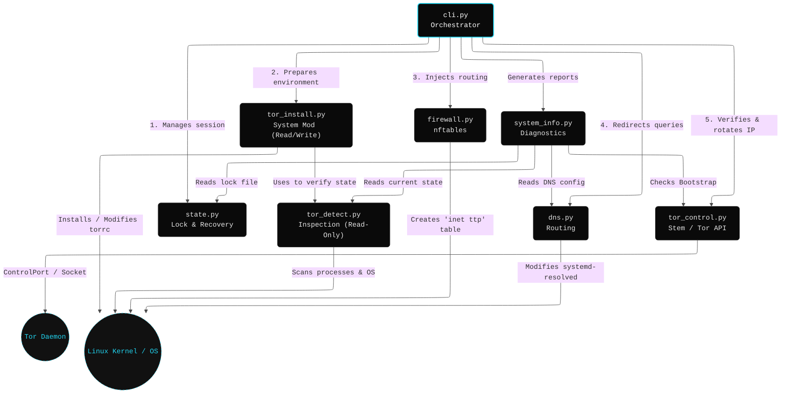

# 🏗️ TTP — Technical Design Document

**MVP Language:** Python 3  
**Target OS:** Linux with systemd *(Debian 12+, Ubuntu 22.04+, Fedora 40+, Arch Linux)*

---

## 📑 Table of Contents

1. [Project Goal](#1-project-goal)
2. [Module Architecture](#2-module-architecture)
3. [Module Details](#3-module-details)
4. [Command Line Interface](#4-command-line-interface)
5. [Dependencies](#5-dependencies)
6. [Project Structure](#6-project-structure)
7. [Native Distribution Support](#7-native-distribution-support)
8. [Development and Test Environment](#8-development-and-test-environment)
9. [Unit Tests — Specifications](#9-unit-tests--specifications)

---

## 1. 🎯 Project Goal

**TTP (Transparent Tor Proxy)** is a CLI tool for Linux that intercepts all outgoing network traffic from a user and forces it through the Tor network, without requiring per-application manual configuration.

Unlike similar tools (TorGhost, Anonsurf), TTP is designed to:

* Work on any modern Linux distribution with systemd.
* Be **crash-safe**: the network state is always restored.
* Be readable and maintainable.
* Be distributable as native system packages (`.deb`, `.rpm`, `PKGBUILD`).

---

## 2. 🧩 Module Architecture

The project is divided into independent Python modules. Each module has a single responsibility and can be tested in isolation.

| Module             | Area             | Responsibility                                                        |
| :----------------- | :--------------- | :-------------------------------------------------------------------- |
| 🔍 `tor_detect.py`  | **Detection**    | Checks Tor presence, status, config, user, and SELinux state.         |
| 📦 `tor_install.py` | **Installation** | Installs Tor via PM, manages SELinux policies, configures `torrc`.    |
| 🧱 `firewall.py`    | **Firewall**     | Generates and applies `nftables` rules in isolated `inet ttp` table (Stateless). |
| 🌐 `dns.py`         | **DNS**          | Manages DNS via `resolvectl` or `resolv.conf`; performs Hard-Reset on stop.       |
| 💾 `state.py`       | **State**        | Manages lock file and emergency rollback logic.                       |
| 🕹️ `tor_control.py` | **Control**      | Encapsulates Tor interaction (Stem, Bootstrap, IP Check).             |
| 🛠️ `system_info.py` | **Diagnostic**   | Gathers system state (torrc, rules, logs) for debugging.              |
| 🖥️ `cli.py`         | **Interface**    | Typer entry point: start, stop, refresh, status, diagnose, uninstall. |

### 2.1 Execution Flow — `start`

1. **cli**: Verifies root execution.
2. **state**: Checks for existing/orphaned locks.
3. **detect**: Verifies Tor installation and config.
4. **install**: Installs/configures Tor if missing. Performs **SELinux optimization** on Fedora.
5. **firewall**: Generates and atomically applies rules in isolated `inet ttp` table.
6. **dns**: Modifies active interface DNS.
7. **state**: Writes lock file (PID, timestamp, backups).
8. **cli**: Waits for bootstrap and verifies IP via `check.torproject.org`.

### 2.2 Execution Flow — `stop` / crash

> [!NOTE]  
> **Normal:** `ttp stop` → reads lock → restores firewall/DNS → deletes lock.

> [!WARNING]
> **Crash (SIGTERM/SIGINT):** Signal handler ensures restoration before shutdown.

> [!IMPORTANT]
> **Worst-case (kill -9):** Next `ttp start` detects orphaned lock and auto-restores.

### 2.3 Flow — `refresh`

Sends `NEWNYM` signal via Stem. Tor changes circuits. Traffic flows normally during the switch.

---

## 3. 🔬 Module Details

### 3.1 `tor_detect.py`

Answers structural questions:

* Installed? (`shutil.which`)
* Running? (`systemctl is-active` + `pgrep -x`)
* Configured? (Checks `TransPort`, `DNSPort`, `ControlPort`)
* User? (Live inspection `ps -eo user:32,comm` → `/etc/passwd` → fallback)
* Service? (`tor@default` vs `tor`)
* SELinux? (Checks if OS is Fedora-family and if SELinux is `Enforcing`)

### 3.2 `tor_install.py`

Intervenes if detection fails or system needs optimization.

1. Detects package manager (`apt-get`, `pacman`, `dnf`, `zypper`).
2. Installs `tor`.
3. **SELinux Optimization**: If on Fedora and enforcing, compiles the custom `ttp_tor_policy.te` policy on-the-fly and installs it via `semodule`. Auto-installs `checkpolicy` if missing.
4. Sanitizes `torrc` (removes malformed `HashedControlPassword`, adds missing options).
5. Validates via `tor --verify-config`.
6. Restarts service.

### 3.3 `firewall.py`

Generates rules applied atomically via `nft -f` into the dedicated `inet ttp` table.

1. **Stateless Logic**: No system-wide rule backups are performed. All modifications are isolated to the `ttp` table.
2. **Atomic Cleanup**: Restoration is performed via `nft destroy table inet ttp`, which is faster and safer than rule-by-rule deletion.
3. **Multi-Chain Architecture**:
    * **NAT Hook (output/prerouting)**: Handles the actual redirection of TCP and DNS packets to Tor's ports (`9040` and `9053`).
    * **Filter Hook (output)**: Implements the **Kill-Switch**. It explicitly allows Tor/Local/Root traffic and rejects everything else.
4. **Execution Sequence**: Tor/Root exclusion -> Redirect DNS -> Accept loopback -> Redirect TCP -> Block IPv6 -> Reject All.

### 3.4 `dns.py`

* **Mode 1 (resolvectl):** Preferred. Uses `resolvectl dns <interface> 127.0.0.1` and sets routing domain `~.` to intercept all queries.
* **Hard-Reset Strategy:** During `stop`, it performs `resolvectl revert` followed by `systemctl restart systemd-resolved` to purge any lingering state.
* **Mode 2 (resolv.conf):** Fallback. Overwrites and restores `/etc/resolv.conf` content.
* **Architectural Limit (DoH/DoT):** DNS-over-HTTPS (port 443) and DNS-over-TLS (port 853) traffic is intercepted by the TCP NAT and anonymized via Tor. However, since these protocols use encrypted wrappers, they bypass Tor's internal resolver. While the traffic remains anonymous, the queries are not handled by the Tor daemon itself, which may lead to fingerprinting if using specific providers (e.g., NextDNS).

### 3.5 `state.py`

Manages `/var/lib/ttp/ttp.lock` (JSON) containing PID, timestamps, and backup paths. Detects orphaned sessions.

### 3.6 `cli.py`

Typer CLI exposing: `start`, `stop`, `refresh`, `status`, `diagnose`, `uninstall`. Pure orchestrator, zero network logic.

### 3.7 `tor_control.py`

Encapsulates all communication with the Tor daemon.

* Connects to Tor's ControlPort/ControlSocket.
* Monitors bootstrap progress.
* Requests new circuits via `Signal.NEWNYM`.
* Verifies exit IP via multiple endpoints for resilience (`check.torproject.org`, `ipify`, `ifconfig.me`).

### 3.8 `system_info.py`

Pure data gathering module, decoupled from UI.

* Reads `/etc/os-release`.
* Captures `systemctl status tor`.
* Greps active `torrc` settings.
* Captures `nft list ruleset`.
* Captures DNS state via `resolvectl`.
* Returns results as a flat dictionary for the CLI to render.

### 3.9 Architecture Graph & Module Interactions

The following dependency graph illustrates how modules interact with each other and with the underlying Linux system. `cli.py` acts as the central brain, orchestrating the specialized modules.

---

## 4. 💻 Command Line Interface

*All commands require `sudo`.*

* `ttp start`
* `ttp stop`
* `ttp refresh`
* `ttp status`
* `ttp diagnose`
* `ttp uninstall`

---

## 5. 📦 Dependencies

| Library    | Source | Purpose                            |
| :--------- | :----- | :--------------------------------- |
| `stem`     | PyPI   | Tor daemon control via Socket/Port |
| `typer`    | PyPI   | CLI framework                      |
| `rich`     | PyPI   | Terminal styling                   |
| `tor`      | System | Tor daemon                         |
| `nftables` | System | Firewall backend                   |

---

## 6. 🗂️ Project Structure

*(See README.md for full tree. Uses standard `pyproject.toml` distribution).*

---

## 7. 📦 Native Distribution Support

TTP provides automated packaging scripts to ensure a native experience on major Linux distributions. These packages handle dependencies, systemd integration, and security policies (SELinux) automatically.

| Format | Distribution | Build Tool | Key Features |
| :--- | :--- | :--- | :--- |
| **.deb** | Debian, Ubuntu, Kali | `dpkg-deb` | Standard `dist-packages` installation, `postinst` service reload. |
| **.rpm** | Fedora, RHEL, Alma | `rpmbuild` | **SELinux Policy integration** via custom `.pp` module. |
| **PKGBUILD** | Arch Linux, Manjaro | `makepkg` | PEP 517 compliant build, AUR-ready structure. |

Building these packages is handled by scripts in the `packaging/` directory:

* `build_deb.sh`: Generates a Debian archive.
* `build_rpm.sh`: Generates a Fedora RPM (requires `rpm-build`).
* `PKGBUILD`: Standard Arch build recipe.

---

## 8. 🧪 Development and Test Environment

### QEMU VM Configuration

* **OS:** Debian 13 (Trixie) Netinstall
* **Network:** NAT + Host-Only (SSH)
* **Workflow:** Code on host → `vm-helpers/send.sh` or `rsync` → Test on VM via SSH.

### Testing Strategy

| Phase | Environment      | Goal                    | Status                  |
| :---- | :--------------- | :---------------------- | :---------------------- |
| 1     | Unit (Host)      | pytest, fully mocked    | 🟢 Passing               |
| 2     | Integration | Docker testing (`.test` files) | 🟢 Validated (Debian, Arch, Fedora) |
| 3     | Portability (VM) | Debian 13, Ubuntu | 🟢 Validated |

---

## 9. 🚥 Unit Tests — Specifications

*(Tests run without root, using `unittest.mock`)*

* **`test_tor_detect.py`**: Verifies dictionary output across varying torrc and process states.
* **`test_firewall.py`**: Asserts DNS redirect appears BEFORE loopback accept (critical). Verifies IPv6 drop.
* **`test_dns.py`**: Asserts correct mode detection (resolvectl vs resolv.conf).
* **`test_state.py`**: Asserts lock creation, reading, and orphan detection.
* **`test_cli.py`**: Verifies command orchestration and UI flow.
* **`test_tor_control.py`**: Verifies Tor daemon interaction and IP checking logic.
* **`test_tor_install.py`**: Asserts correct PM selection and torrc sanitization.
