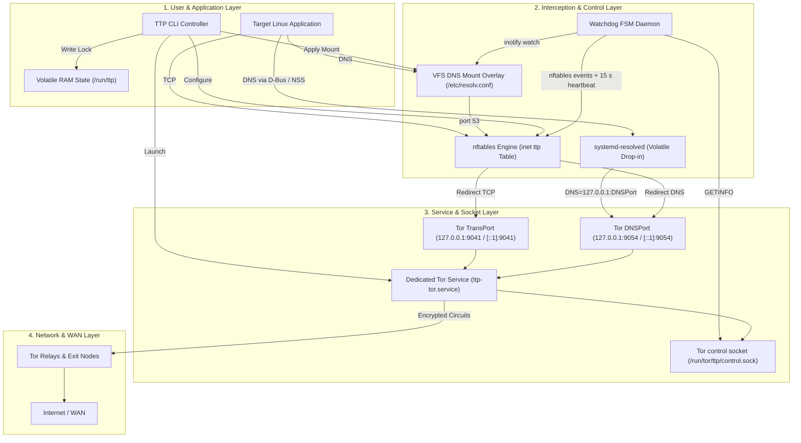

# Explanation: System Architecture and Execution Flow

TTP transparently routes all system TCP traffic and DNS queries through the Tor network by orchestrating Linux kernel subsystems, system utilities, and Tor control interfaces without modifying persistent host configurations.

---

## 1. System Layer Diagram



---

## 2. Kernel Network Pipeline (`nftables` Interception)

Interception lives in one table, `inet ttp`, loaded atomically in a single `nft`
transaction and generated by `ttp/firewall/builder.py`. Abridged, with the default
ports, IPv6 available and systemd-resolved active:

```text
table inet ttp {
    chain prerouting {                     # traffic arriving from other interfaces
        type nat hook prerouting priority dstnat; policy accept;
        udp dport 53 dnat ip to 127.0.0.1:9054    # and tcp, and the ip6 forms
        ip daddr { 10.0.0.0/8, 172.16.0.0/12, 192.168.0.0/16, 169.254.0.0/16 } accept
        ip protocol tcp dnat ip to 127.0.0.1:9041
    }

    chain output {                         # nat: rewrite the destination
        type nat hook output priority -150; policy accept;
        meta skuid <tor> accept                   # Tor itself reaches the Internet
        # bypass users, groups and the ttp bypass cgroup accept here
        udp dport 53 dnat ip to 127.0.0.1:9054    # DNS first, before the LAN bypass
        tcp dport 53 dnat ip to 127.0.0.1:9054
        ip daddr { 10.0.0.0/8, 172.16.0.0/12, 192.168.0.0/16, 169.254.0.0/16 } accept
        ip daddr 127.0.0.0/8 accept
        ip protocol tcp dnat ip to 127.0.0.1:9041 # every other TCP connection
    }

    chain filter_out {                     # filter: the kill-switch
        type filter hook output priority filter; policy accept;
        meta skuid <tor> accept
        # --no-ipv6 / no IPv6 loopback: drop all IPv6 here, before any exemption
        # bypass users, groups and the ttp bypass cgroup accept here
        meta skuid <resolved> ip daddr != 127.0.0.1 drop
        # DNS whose original destination was port 53 but that is not headed
        # for Tor's DNSPort (a foreign NAT chain got to it first): reject
        ip daddr { LAN ranges } accept
        ip daddr 127.0.0.0/8 accept
        fib daddr type local accept
        tcp dport 853 reject                      # defence in depth, see below
        ip daddr { known DoH resolvers } tcp dport 443 reject
        meta l4proto tcp reject with tcp reset    # catch-all: TCP gets a reset
        reject                                    # catch-all: everything else
    }

    chain filter_forward {
        type filter hook forward priority filter; policy drop;
    }
}
```

`sudo nft list table inet ttp` shows the full ruleset of a running session,
comments included.

### Packet Routing Logic

1. **Exemptions**: Tor's own UID, bypass users and groups (`--bypass-user`,
   `--bypass-group`) and the `ttp bypass` cgroup are accepted in both chains.
   Root is exempt only with `--allow-root`.
2. **DNS**: UDP and TCP port 53 are redirected to Tor's DNSPort, *before* the LAN
   bypass, so a LAN resolver cannot receive a cleartext query.
3. **LAN and loopback**: RFC 1918, link-local and loopback destinations are left
   alone (`--no-lan-bypass` removes the LAN part).
4. **TCP**: every remaining TCP connection is redirected to Tor's TransPort.
5. **Kill-switch**: whatever reaches the bottom of `filter_out` is rejected - UDP,
   ICMP, raw sockets, and TCP that somehow escaped the redirect. TCP gets a reset
   rather than ICMP, so a connection opened before `ttp start` is ended at its next
   packet instead of hanging.
6. **Forwarding**: `filter_forward` drops all forwarded traffic, so routed
   containers and VMs cannot reach the Internet around Tor.

The DoT and DoH rejects are **not** how TTP handles DoH and DoT: by the time
`filter_out` runs, `nat output` has already rewritten a non-bypassed TCP connection
to `127.0.0.1`, so those rules only fire if the redirect failed. Each carries a
named counter, and the watchdog treats any new packet on one as an integrity
failure ([ADR 0012](https://github.com/onyks-os/TransparentTorProxy/blob/main/docs/decisions/0012-doh-dot-and-browser-leaks-are-out-of-scope.md)).

---

## 3. Stateless DNS Overlay Subsystem

System DNS resolution is isolated through a dual-mechanism approach:

### VFS Bind-Mount Overlay

TTP creates a temporary RAM-backed `resolv.conf` file containing `nameserver 127.0.0.1` and overlays `/etc/resolv.conf` using a VFS kernel bind-mount (`mount --bind`).

- **Disk Integrity**: The physical `/etc/resolv.conf` file on host storage is untouched.
- **Teardown**: Upon session termination, `umount -l /etc/resolv.conf` unmounts the overlay instantly.

### `systemd-resolved` Volatile Integration

If `systemd-resolved` is active, TTP writes a volatile drop-in configuration at `/run/systemd/resolved.conf.d/ttp.conf` setting `DNS=127.0.0.1:<DNSPort>`, `Domains=~.` and `DNSOverTLS=no`, then restarts it and flushes its cache. Applications that ask `systemd-resolved` directly, over D-Bus or NSS, therefore also end at Tor. Behind that, `filter_out` drops every packet from resolved's UID that is not addressed to loopback, so a per-link DNS server pushed by NetworkManager or a VPN produces a failed lookup, not a leak ([ADR 0009](https://github.com/onyks-os/TransparentTorProxy/blob/main/docs/decisions/0009-systemd-resolved-bypass.md)).

---

## 4. Volatile Storage and Memory Layout

TTP enforces a strict zero-disk residue design policy. All operational data is stored in `tmpfs` RAM filesystems:

| Path | Storage Type | Purpose |
|---|---|---|
| `/run/ttp/ttp.lock` | `tmpfs` | Atomic session lockfile containing active parameters. |
| `/run/ttp/ttp.log` | `tmpfs` | Volatile session log buffer. |
| `/run/tor/ttp/torrc` | `tmpfs` | Generated Tor daemon runtime configuration. |
| `/run/tor/ttp/control.sock` | `tmpfs` | Unix domain socket for Tor's control interface. |

Because all state resides under `/run`, any abrupt power loss or hard reboot automatically purges all runtime artifacts without manual intervention.
