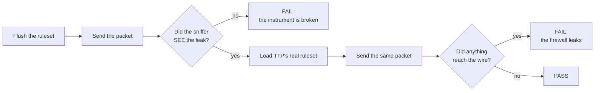

<!--
Copyright (c) 2026 onyks-os
SPDX-License-Identifier: MIT
-->

# Explanation: How the zero-leak claim is verified

TTP's central claim is that no cleartext packet reaches the WAN. This page is
about why you should believe it, and about the mistake that made an earlier
version of that evidence worth nothing.

---

## The problem with testing for an absence

The obvious test is:

```python
captured = sniffer.stop()
assert [p for p in captured if is_leak(p)] == []
```

That assertion is true when the firewall works. It is *also* true when the
sniffer never started, when the interface name is wrong, when the BPF filter
excludes the traffic, and when the stimulus never left the process. Four wrong
reasons, one right one, and nothing in the output distinguishes them.

For most of this project's life, that was the whole of the zero-leak suite - and
it was worse than that, because nothing executed it: no make target, no CI job,
no step in the release pipeline. A claim that nothing runs is not a measurement.

## What the suite does now

Every containment test runs its stimulus **twice**.



The first half is the **positive control**. It proves, on this machine, in this
run, for this exact traffic, that the harness can detect a leak. Only then is the
absence of one meaningful. If the control fails, the test fails there - it never
reaches the assertion that would have passed for the wrong reason.

## What is covered

Each of these is a path by which a transparent proxy is known to leak:

| Stimulus | What it proves |
| :--- | :--- |
| UDP DNS to a public resolver | plain DNS is redirected to Tor's DNSPort |
| TCP DNS (port 53) | the other DNS path, redirected separately |
| TCP to a web port | ordinary traffic reaches Tor's TransPort |
| DoT (TCP 853) | it never reaches the WAN in cleartext: like any TCP it is redirected to Tor |
| QUIC DoH (UDP 443) | the gap NAT cannot close - UDP is not redirected, so the reject must stop it |
| ICMP | Tor cannot carry it, so it must be rejected |
| Arbitrary UDP | the catch-all reject holds |
| IPv6, and routable ICMPv6 | the classic leak path when a proxy only reasons about IPv4 |

Three of them are also checked for *which rule* handled the packet, read back from
TTP's named counters: DNS by the DNS redirect, TCP by the TransPort redirect, ICMP
by a reject. "Nothing leaked" alone cannot tell a redirect from an unrelated drop.

The same ruleset is then tested against the situations real hosts create:

| Situation | What it proves |
| :--- | :--- |
| A Docker-, ufw-, firewalld- (2.4.4, captured) or WireGuard- (`wg-quick`, captured) shaped ruleset loaded alongside | containment holds when another table has base chains at the same hooks; nftables resolves those by priority, not ownership |
| A foreign NAT chain that DNATs DNS to a LAN resolver before TTP's redirect | the query is rejected instead of leaving through the LAN bypass |
| Traffic forwarded through the host | `filter_forward` drops it |
| The teardown lockdown | it closes the bypass while sparing Tor, and destroying the rules leaves nothing behind |
| A connection open before `ttp start` | it is reset, not left hanging; a LAN connection survives |

And assertions in the other direction:

| Stimulus | What it proves |
| :--- | :--- |
| Traffic from a bypassed UID to the LAN | TTP is a proxy, not a brick |
| The reply to it | the bypass works in both directions |

Those last rows matter more than they look. A firewall that dropped every packet
would pass every containment test. Without a test that something is *still
allowed*, "zero leaks" and "zero connectivity" are indistinguishable.

## Where it runs

The rules are loaded into an ephemeral Linux network namespace built by the
[Network Sandbox Engine](https://github.com/onyks-os/NetworkSandboxEngine), with
a Scapy sniffer on the boundary `veth`. The ruleset under test is the **real
generated one**, captured from TTP's own builder rather than written by hand for
the test - so a change to rule generation is visible here.

```bash
sudo apt install nftables iproute2 conntrack libpcap0.8 libpcap-dev
pip install -e ".[nse]"
make test-nse
```

`make test-nse` sets `TTP_REQUIRE_NSE=1`, which turns a missing, shadowed or
too-old engine into a hard error instead of a skip. A gate that can skip itself
is not a gate, and `nse` is a short import name that an unrelated PyPI package
can shadow - which looks exactly like "not installed".

The suite runs in CI on every push, and as a step in `scripts/verify.sh` before
a release.

## What a namespace cannot show

A namespace has no boot, no shutdown and no NetworkManager, and nobody tampers with
it while it runs. Two more suites cover that, in a disposable VM, in CI
(`.github/workflows/lifecycle.yml`) whenever firewall, lifecycle, DNS or watchdog
code changes, and weekly:

- **Lifecycle transitions**: shutdown, reboot and suspend/resume onto a new
  network, judged from a packet capture QEMU writes outside the guest, under
  systemd-networkd and under NetworkManager.
- **The watchdog chaos sweep**: every fault once against a live session. Each audit
  is paired with a **canary**, a bypassed user audited the same way in the same
  pass, which must be seen - the same positive-control rule, applied to a running
  host.

What they assert and what they found is in section 4.3 of the
[security assessment](https://github.com/onyks-os/TransparentTorProxy/blob/main/docs/security-assessment.md#43-lifecycle-transitions-what-is-measured-and-what-is-not).

## The dependency, and why it is pinned hard

`network-sandbox-engine>=2.1.2,<3`. The floor is not a preference.

Before 2.1.0 the engine's own test runner reported PASSED when its oracle had
observed nothing, and its kernel trace monitor could stop reading mid-run without
saying so. Before 2.1.2 its sniffer's default BPF filter discarded all ICMPv6 in
the kernel, routable echoes included, so the routable-ICMPv6 test could not see its
own subject. A green result from such an engine would not have been evidence of
anything - the same defect as the one described at the top of this page, one
layer down. TTP refuses to run this suite against an older engine rather than
produce a reassuring number.

See [ADR 0007](https://github.com/onyks-os/TransparentTorProxy/blob/main/docs/decisions/0007-ruleset-testing-with-nse.md)
for the decision record and its amendment.

## The rule, generalised

> A test that asserts an absence must first demonstrate it can detect a presence.

It applies well beyond firewalls. Any check for the non-occurrence of something -
no error logged, no file written, no request sent - has the same failure mode,
and needs the same paired control.
