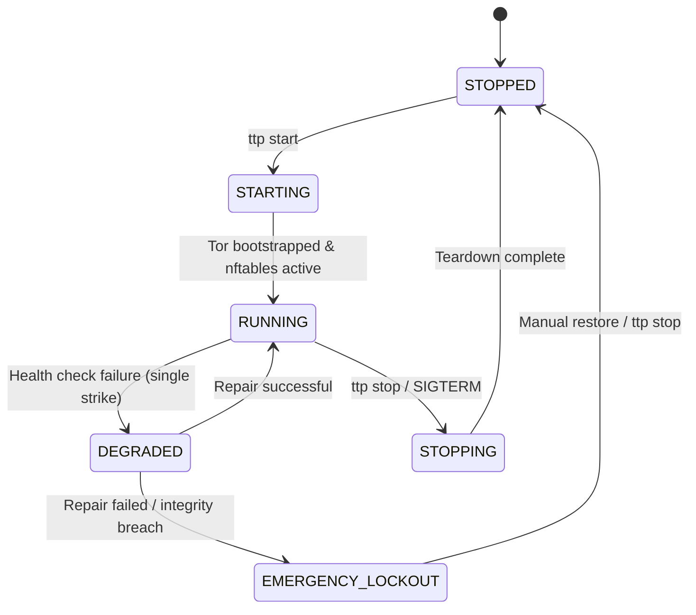

# Explanation: Watchdog Finite State Machine (FSM)

The TTP watchdog daemon runs an active background monitor governed by a formal Finite State Machine (FSM) utilizing the `transitions` library.

---

## 1. FSM State Diagram

---

## 2. Integrity Checks Performed

The watchdog runs periodic checks every 5 seconds asserting:
1. **Tor Process & Socket**: Tor daemon process is alive and control socket is responsive.
2. **`nftables` Table Integrity**: The `inet ttp` table and `filter_out` chain exist in kernel state.
3. **DNS Overlay Integrity**: `/etc/resolv.conf` double-watch check (verifying mount point and symlink target).

---

## 3. Emergency Lockout (Fail-Closed)

If integrity repairs fail, the watchdog triggers `apply_emergency_killswitch()`, replacing the `inet ttp` table with a minimal drop-all policy that locks down physical interfaces while preserving loopback.
