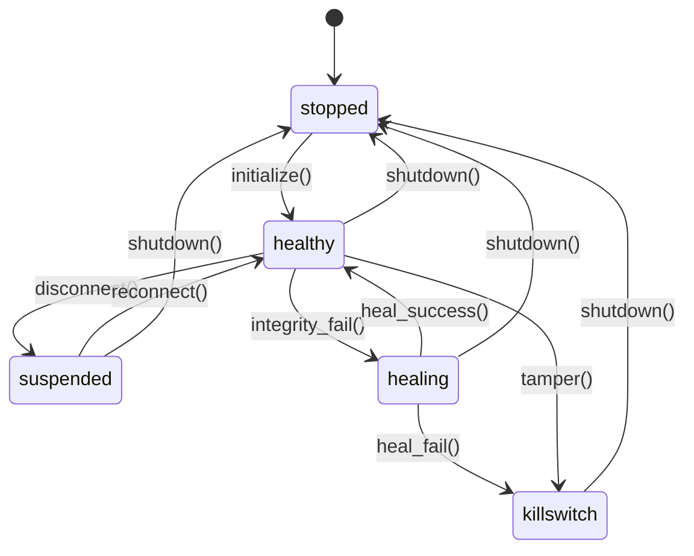

# Explanation: Watchdog Finite State Machine (FSM)

The watchdog is an optional background daemon that checks, while a session is
running, that the session is still the one `ttp start` built. It is started with
`sudo ttp start --watchdog` (or later with `sudo ttp watchdog start`); without it,
nothing watches a running session.

Its state is governed by a finite state machine built on the Python `transitions`
library (`ttp/watchdog/fsm.py`,
[ADR 0010](https://github.com/onyks-os/TransparentTorProxy/blob/main/docs/decisions/0010-watchdog-finite-state-machine.md)).

---

## 1. How it runs

The daemon is a volatile systemd unit, `/run/systemd/system/ttp-watchdog.service`,
running `ttp watchdog run`:

- as the `ttp-watchdog` account when it exists, with only `CAP_NET_ADMIN` and
  `NoNewPrivileges=yes`. It can read the session lock but not write it, and it
  writes only to its own directory, `/run/ttp/watchdog`;
- with `Wants=ttp-tor.service`, not `Requires=`. Stopping Tor must not stop the
  process whose job is to notice that Tor stopped;
- with `Restart=on-failure`.

It does not poll. It sleeps in `select()` on two event sources and a heartbeat:

| Source | Wakes it when |
| :--- | :--- |
| A netlink socket subscribed to nftables events | any nftables ruleset changes, TTP's or anyone else's |
| An inotify watch on `/etc/resolv.conf` (the path and its symlink target) | the DNS overlay is touched |
| A 15-second timeout | nothing else happened: a periodic check |

Each wake-up runs the full integrity check below. A table flushed or altered by
another process reaches the killswitch in tens of milliseconds (31-48 ms measured;
see section 4.3 of the
[security assessment](https://github.com/onyks-os/TransparentTorProxy/blob/main/docs/security-assessment.md)).

---

## 2. States


```mermaid
stateDiagram-v2
    [*] --> stopped
    stopped --> healthy : initialize()
    healthy --> suspended : disconnect()
    suspended --> healthy : reconnect()
    healthy --> healing : integrity_fail()
    healing --> healthy : heal_success()
    healing --> killswitch : heal_fail()
    healthy --> killswitch : tamper()
    healthy --> stopped : shutdown()
    suspended --> stopped : shutdown()
    healing --> stopped : shutdown()
    killswitch --> stopped : shutdown()
```

| State | Meaning |
| :--- | :--- |
| `stopped` | Not monitoring. The initial state, and the final one once the session lock is gone. |
| `healthy` | The last integrity check passed. Waiting for the next event or heartbeat. |
| `suspended` | The link is down or there is no default route. Checks are paused; the link is re-tested every 5 seconds, and on reconnection the watchdog waits 10 seconds for Tor's circuits before resuming. |
| `healing` | A check failed. The watchdog attempts one repair, then re-checks. |
| `killswitch` | The emergency killswitch is applied and held. There is no transition out of it except `shutdown`: the watchdog stops only when `ttp stop` stops it, or when the session lock is gone. |

`tamper()` is the path for an unexpected error inside the watchdog loop itself:
a watchdog that no longer knows what state it is in fails closed.

---

## 3. What is checked

Every wake-up runs the same checks, in this order. The first failure ends the
check and names the component.

| Component | Check |
| :--- | :--- |
| `dns` | `/etc/resolv.conf` (or its symlink target) is still a mount point, and every `nameserver` in it is `127.0.0.1` or `::1`. |
| `dns` | If `systemd-resolved` was active at start: TTP's drop-in `/run/systemd/resolved.conf.d/ttp.conf` still exists and the service is still active. |
| `firewall` | The `inet ttp` table exists and matches, rule for rule, the fingerprint `ttp start` recorded in the lock. A chain-name check would pass a flushed table, which leaks everything. |
| `firewall` | Each bypass user and group recorded in the lock still has its rule. |
| `firewall` | The DoT, DoH and un-redirected-DNS reject counters have not moved since the previous check. Those rules are only reachable when the NAT redirect has failed, so a new packet on any of them is an alarm about TTP itself ([ADR 0012](https://github.com/onyks-os/TransparentTorProxy/blob/main/docs/decisions/0012-doh-dot-and-browser-leaks-are-out-of-scope.md)). |
| `tor` | Tor's control socket answers a `GETINFO`; if the socket is unavailable, `ttp-tor.service` is active. |

---

## 4. What happens on a failure

Only Tor is repaired. Everything else is treated as tampering.

| Failed component | Response |
| :--- | :--- |
| `tor` | `systemctl restart ttp-tor.service`, then a re-check after 3 seconds. If the session is intact, back to `healthy`; if not, killswitch. |
| `dns` or `firewall` | No repair is attempted: a table or overlay that changed under a running session is not something to guess back into shape. Straight to the killswitch. |

After a repair, events are ignored for a 2-second cooldown so that the repair's own
changes do not trigger a second round.

---

## 5. The emergency killswitch

`apply_emergency_killswitch()` replaces the `inet ttp` table, in one atomic
transaction, with:

```text
table inet ttp {
    chain filter_out {
        type filter hook output priority filter; policy drop;
        oifname "lo" accept
    }
    chain filter_forward {
        type filter hook forward priority filter; policy drop;
    }
    chain filter_input {
        type filter hook input priority filter; policy drop;
        iifname "lo" accept
    }
}
```

Everything is dropped in every direction except loopback. The watchdog then
announces it with `wall` and `notify-send`.

The killswitch is **held**, not fired and forgotten. Every 2 seconds the watchdog
compares the table with the listing it took right after applying it, and
re-applies it if the table was removed or altered - an `accept` added to it empties
it just as surely as deleting it. The network stays down until the administrator
runs `sudo ttp stop`, which stops the watchdog first and then tears the session
down.
